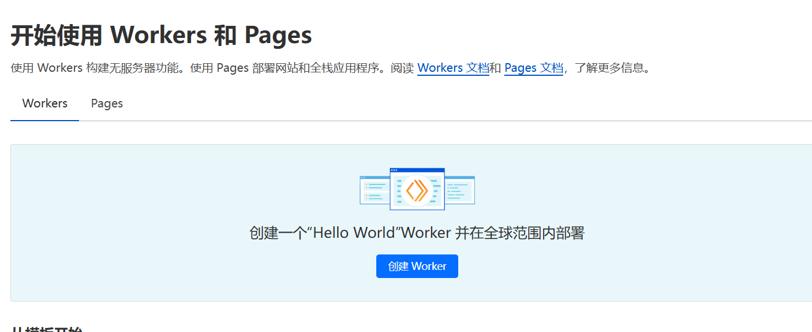
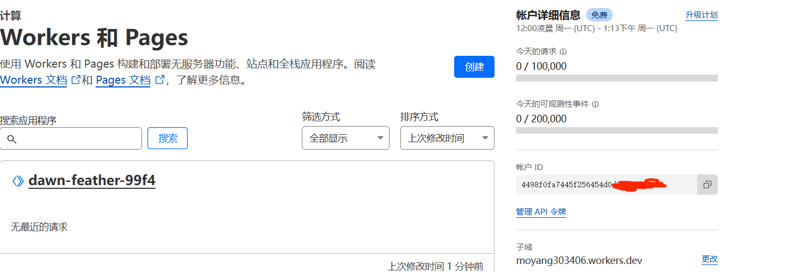
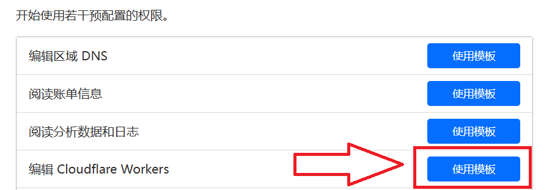
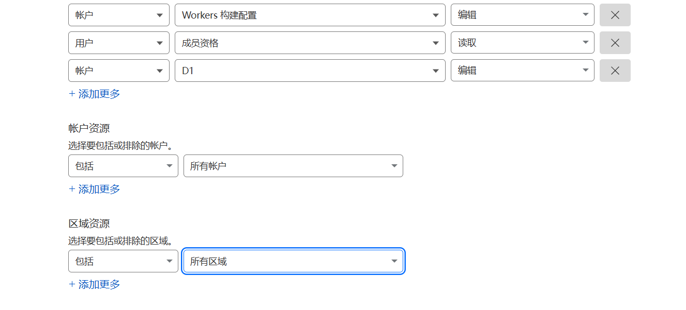
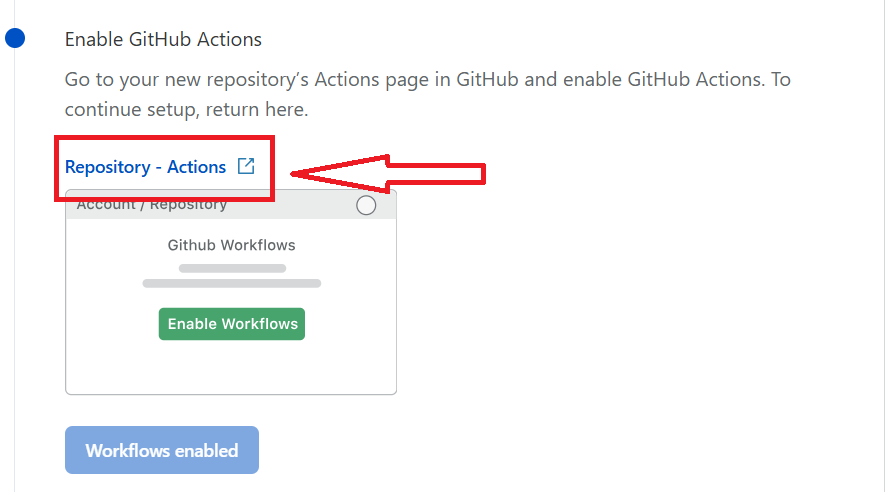
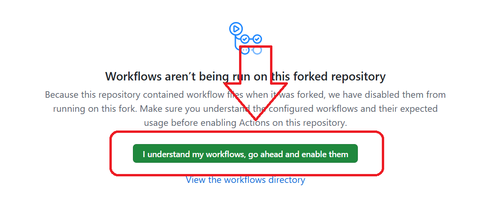
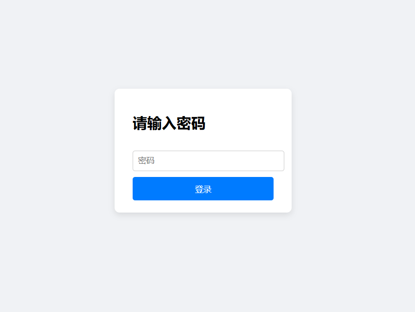

# OpenAI Grok Cloudflare Worker

## 项目原地址
该项目基于orbitoo大佬的[grok_chat_proxy](https://github.com/orbitoo/grok_chat_proxy)我仅仅只是使其能在Workers上运行，用于转发聊天请求至目标地址，同时提供一个基于 D1 SQL 数据库的配置管理页面，实现 Cookie 轮询、模型列表返回、消息预处理等功能。

## 功能概述

- **API 接口**
  - **GET /v1/models**：返回模型列表（模型名称：`grok-2`、`grok-3`、`grok-3-thinking`）。
  - **POST /v1/chat/completions**：消息转发接口。

- **配置管理页面**
  - 访问 `/config` 时需要密码验证（密码由环境变量 `CONFIG_PASSWORD` 设置，默认为123）。
  - 未登录时自动重定向到 `/config/login` 登录页面。
  - 登录成功后在 Cookie 中写入认证信息，进入配置管理界面。
  - 页面支持添加 Cookie、删除单个 Cookie、删除全部 Cookies 以及切换 Temporary Mode。

- **Cookie 轮询**
  - 使用数据库中存储的 Cookie 列表，实现对不同模型请求时的 Cookie 自动轮询。

- **消息预处理**
  - 支持对输入消息进行预处理，自动处理特殊标识符（例如 `<|disableSearch|>`、`<|forceConcise|>`）以及格式化消息。

## 部署步骤  

### 使用 GitHub Actions 一键部署至 Cloudflare Workers  

点击下方按钮，将脚本部署到您的 Cloudflare Workers：  

  

### 1. 部署到 Cloudflare Workers  
点击上方 **"Deploy to Cloudflare Workers"** 按钮。  

### 2. 账户配置  
确保您拥有 **Cloudflare 账户**，然后填写以下信息：  

#### **获取 Cloudflare Account ID**  
- 进入 [Workers Dashboard](https://dash.cloudflare.com/?to=/:account/workers)  
- 若遇到下图情况，先随便创建一个 Workers 部署  
    
- 复制 **Account ID** 并粘贴到部署页面  
    

#### **获取 Cloudflare API Token**  
- 进入 [My Profile](https://dash.cloudflare.com/?to=/:account/workers)  
- 创建 API Token，选择如下模板  
    
- **一定要添加 D1 的读写权限**（非常重要！） 
- **一定要添加 D1 的读写权限**（非常重要！） 
- **一定要添加 D1 的读写权限**（非常重要！）  
    
- 复制 API Token 并粘贴到部署页面  

### 3. 启用 GitHub Actions  
- 进入 **GitHub 仓库**，点击 **Repository - Actions**  
    
- 启用 Actions  
    

### 4. 运行部署流程  
- 进入 **部署流程页面**，点击 **Workflow Enabled**  
- 点击 **Deploy** 开始部署  

### 5. 访问部署的 Worker  
- 进入 **Cloudflare Workers 页面**，找到 `grok` Worker  
- 访问 Worker，即可看到 grok 配置页面  
    
- **默认密码：123**，可在 Workers 变量中修改  

## 使用说明

- **API 测试**：
  - 访问 `/v1/models` 获取模型列表。
  - 通过 POST 请求访问 `/v1/chat/completions` 接口进行消息转发，支持传入参数 `messages`、`model`、`stream` 等参数。

- **配置管理**：
  - 访问 `/config` 页面进行 Cookie 管理及临时模式切换。
  - 若未登录，会自动重定向到 `/config/login`，输入正确密码后可管理配置。

## 其他说明

- **安全性**：环境中建议修改 `CONFIG_PASSWORD` 为更高强度的密码，确保配置管理页面的安全。。

---

